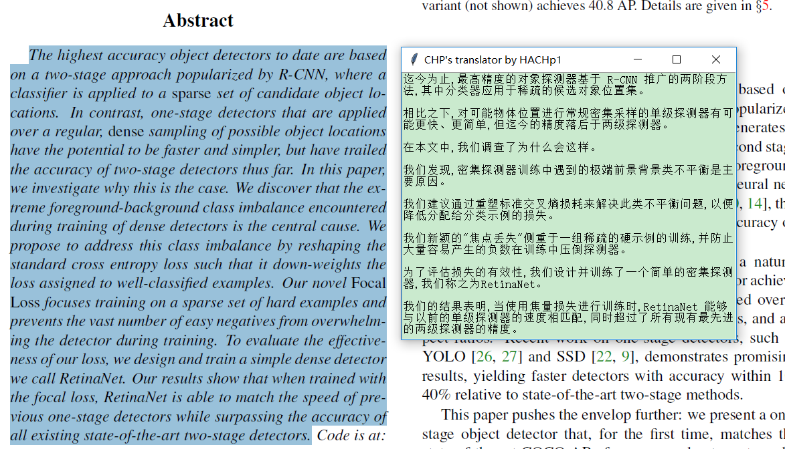
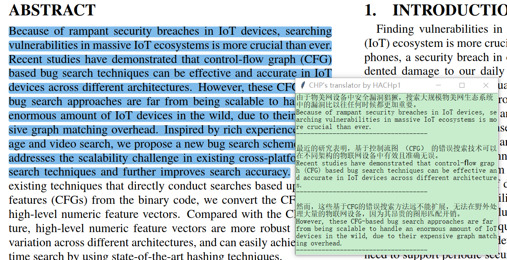

# EZ Trans

### 简介

* 弹窗翻译pdf英文论文用的小工具，避免换行符的尴尬，免去打开浏览器的过程，翻译只需三个键，妈妈再也不用担心我看论文原文了:)
* 可以切换多个翻译接口

### 功能

- [ ] 修复百度翻译1022错误
- [ ] 修改'Fig. x'导致中应为断句错误
- [ ] 支持双击ctrl+c开始翻译
- [ ] 加入Google翻译的支持

## 环境

* 支持Win/MAC/ubuntu，python3

## 安装方法

* 安装前请使用pip安装pywin32、keyboard、brotli、xerox、pyautogui、PyExecJS以及requests库：

```
pip install pywin32
```

``` bash
pip install -i https://pypi.tuna.tsinghua.edu.cn/simple pywin32keyboard brotli xerox pyautogui requests PyExecJS
```

* 安装：

``` bash
python setup.py build
python setup.py install
```

## 用法

* 安装好后，在命令行中输入`chptrans`打开翻译器，复制想翻译的英文（ctrl+c)，复制完后按f键翻译（翻译器会将剪切板中的内容翻译为中文）。
* 按`ctrl+e`可以切换中英对照模式。
* 按`ctrl+r`可以切换翻译器。

## 使用截图

普通模式：



中英对照模式：



## 更新日志

* 2021.11.21 fork from HACHp1/chptrans

## 感谢

- [HACHp1/chptrans](https://github.com/HACHp1/chptrans)
- [ ZCY01/BaiduTranslate ](https://github.com/ZCY01/BaiduTranslate)
